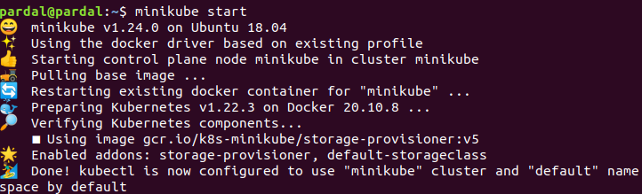
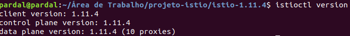

# Controle de throttling utilizando o Istio

## 🚀 Começando

A experimentação foi feita utilizando o sistema operacional Linux

Consulte **Implantação** para saber como implantar o projeto.

### 📋 Pré-requisitos

* Cluster com Kubernetes rodando na máquina. Nesse tutorial foi utilizado a versão 1.22 do Kubernetes com o minikube. [Tutorial Minikube](https://minikube.sigs.k8s.io/docs/start/)
```
minikube start 
```



* Instalação do Istio. Nesse tutorial foi utilizado a versão 1.11.4 [Tutorial Istio](https://istio.io/latest/docs/setup/getting-started/)
```
istioctl version
```


### 🔧 Desenvolvimento

Uma série de exemplos passo-a-passo que informam o que você deve executar para ter um ambiente de desenvolvimento em execução.

Diga como essa etapa será:

```
Dar exemplos
```
##### Observação: ao alterar o ConfigMap, o serviço do ratelimit deve ser reiniciado. É uma limitação da feature. Existe uma solução paralela que pode ser utilizada, mas ainda não foi testada

```
https://kubectl.docs.kubernetes.io/guides/config_management/secrets_configmaps/
```


## ⚙️ Executando os testes

Explicar como executar os testes automatizados para este sistema.

### 🔩 Analise testes de carga

#### Teste sem o header api-key
```
Dar exemplos
```
#### Teste com o header api-key sem parâmetro limitador
```
Dar exemplos
```
#### Teste com o header api-key com parâmetro limitador
```
Dar exemplos
```

## 📌 Limpando o ambiente 

Explicar como executar os testes automatizados para este sistema.

```
kubectl delete deployment ratelimit
kubectl delete deployment redis
kubectl delete envoyfilter filter-ratelimit -n istio-system
kubectl delete envoyfilter filter-ratelimit-svc -n istio-system
kubectl delete svc redis
kubectl delete svc ratelimit
```

## ✒️ Próximos passos

Explicar como executar os testes automatizados para este sistema.

---
⌨️ com ❤️ por [Armstrong Lohãns](https://gist.github.com/lohhans) 😊
