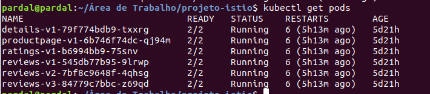
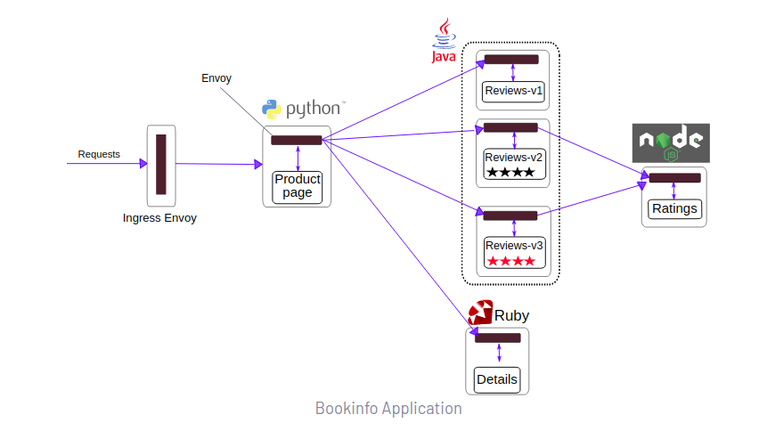
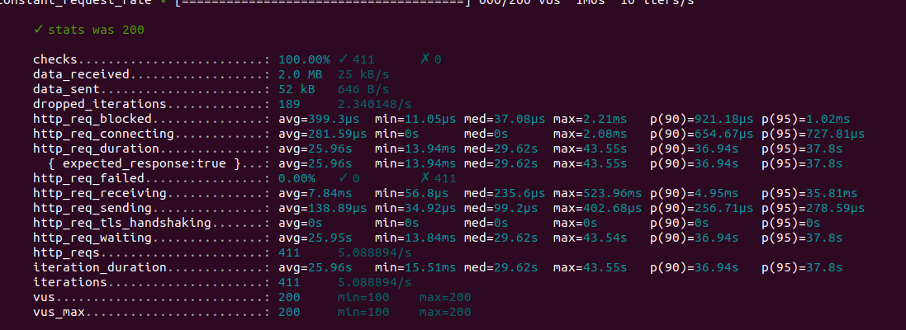
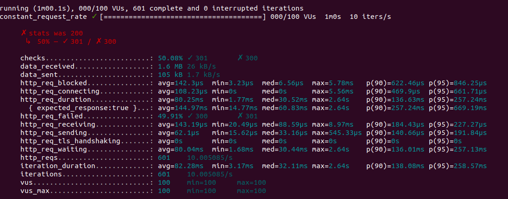
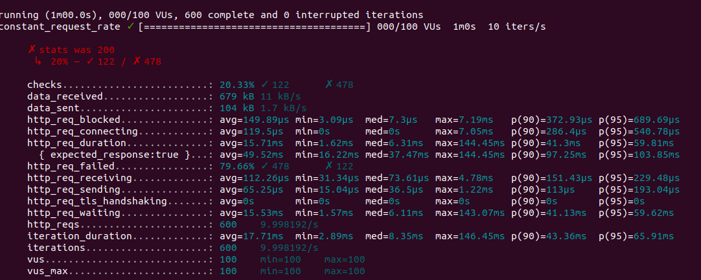

# Controle de throttling utilizando o Istio

## 🚀 Começando

A experimentação foi feita utilizando o sistema operacional Linux. O objetivo é utilizar o EnvoyFilter (sidecar proxy) do Istio para habilitar a feature de limitação de tráfego. O Envoy suporta 2 tipos de limitação: local e global. As limitações locais são usadas para limitar as requisições por serviço (in-mesh traffic). Já a limitação global é utilizada para limitação pelo ingress gateway. Nessa POC será utilizada apenas a global, mas as duas poderiam ser utilizadas juntas. 


#### Vantagens do service mesh
* Remoção do controle de tráfego da camada de serviço no Kubernetes por meio do sidecar proxy - permitindo mais elasticidade.
* Controle de politicas, observability e muito mais

[Referência](https://www.tetrate.io/blog/why-do-you-need-istio-when-you-already-have-kubernetes/)


### 📋 Pré-requisitos

* Cluster com Kubernetes rodando na máquina. Nesse tutorial foi utilizado a versão 1.22 do Kubernetes com o minikube. [Tutorial Minikube](https://minikube.sigs.k8s.io/docs/start/)
```
minikube start 
```


* Instalação do Istio. Nesse tutorial foi utilizado a versão 1.11.4 [Tutorial Istio](https://istio.io/latest/docs/setup/getting-started/)
```
istioctl version
```


* Deploy da aplicação padrão Bookinfo [Tutorial App](https://istio.io/latest/docs/examples/bookinfo/)
```
kubectl get pods
```




### 🔧 Desenvolvimento


O serviço rate limit é um serviço Go / gRPC projetado para permitir cenários genéricos de limite de taxa de diferentes tipos de aplicativos. Os aplicativos solicitam uma decisão de limite de taxa com base em um domínio e um conjunto de descritores. O serviço lê a configuração do disco por meio do tempo de execução, compõe uma chave de cache e se comunica com o cache do Redis. A decisão é então devolvida ao chamador.

[Referência](https://github.com/envoyproxy/ratelimit#configuration)

Executando os scripts para criação da infraestrutura:

```
kubectl apply -f config/config-map.yaml
```

No nosso caso poderia ser um arquivo editado pelos nossos consumidores.

```
kubectl apply -f config/rate-limit-svc.yaml
```

```
kubectl apply -f config/envoy-filter.yaml
```

##### Observação: ao alterar o ConfigMap, o serviço do ratelimit deve ser reiniciado. É uma limitação da feature. Existe uma solução paralela que pode ser utilizada, mas ainda não foi testada

```
https://kubectl.docs.kubernetes.io/guides/config_management/secrets_configmaps/
```


## ⚙️ Executando os testes

Explicar como executar os testes automatizados para este sistema.

### 🔩 Analise testes de carga

#### Teste sem o header api-key



#### Teste com o header api-key sem parâmetro limitador



#### Teste com o header api-key com parâmetro limitador



## 📌 Limpando o ambiente 

Explicar como executar os testes automatizados para este sistema.

```
kubectl delete deployment ratelimit
kubectl delete deployment redis
kubectl delete envoyfilter filter-ratelimit -n istio-system
kubectl delete envoyfilter filter-ratelimit-svc -n istio-system
kubectl delete svc redis
kubectl delete svc ratelimit
```

## ✒️ Próximos passos

Refinar a aplicabilidade de usar o local rate limit.

---
⌨️ com ❤️ por [Armstrong Lohãns](https://gist.github.com/lohhans) 😊
